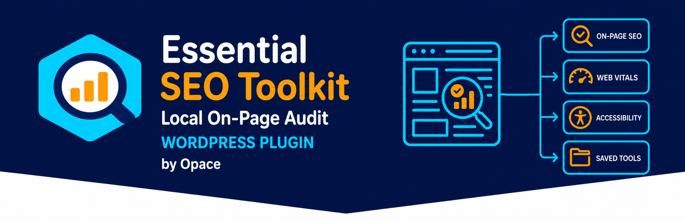
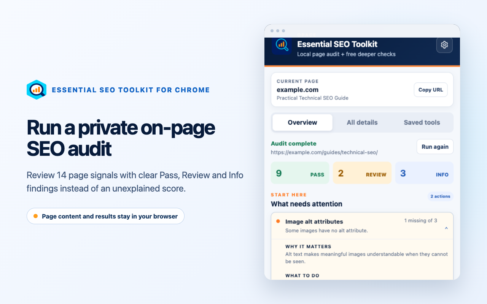
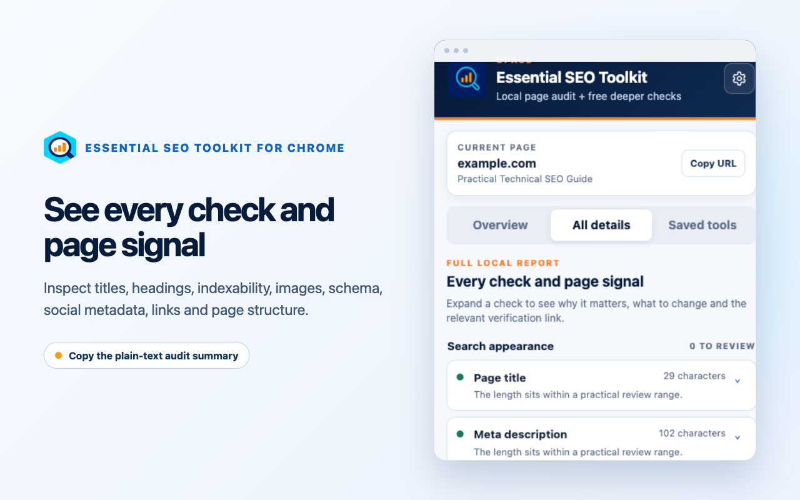
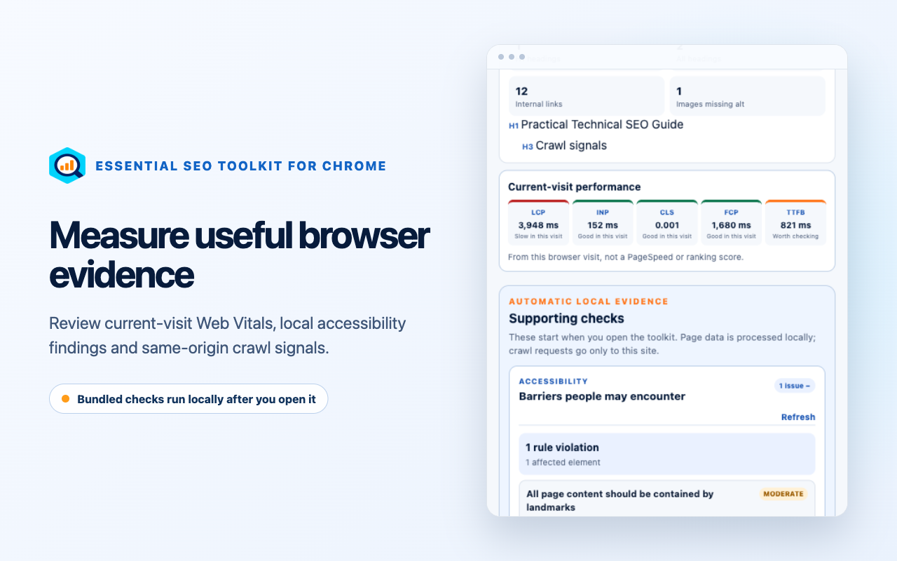
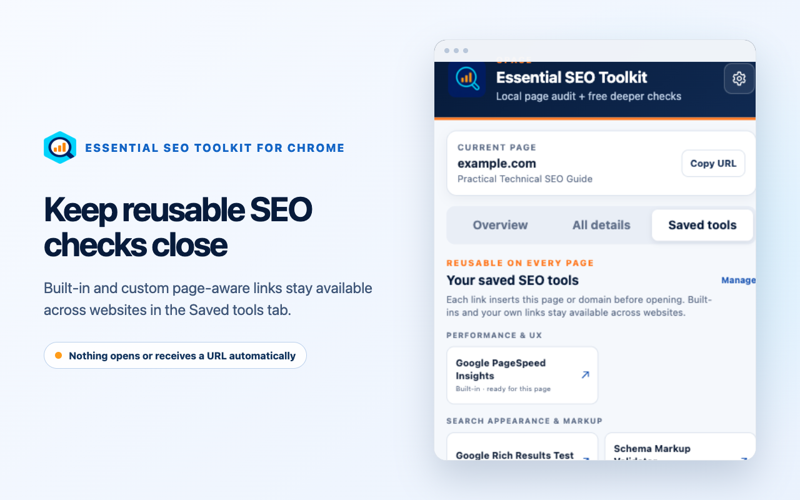

# Opace Essential SEO Toolkit & SEO Audit Tool – Google Chrome Extension



[](https://github.com/OpaceDigitalAgency/essential-seo-toolkit-chrome-extension/releases/tag/v5.0.0)
[](https://chromewebstore.google.com/detail/icagkiolfkmndbggheneeamfbnobcdma)
[](manifest.json)
[](LICENSE)

Opace Essential SEO Toolkit & SEO Audit Tool is a privacy-first SEO tool for Google Chrome. It runs a practical on-page SEO audit of the active tab, explains each finding without inventing an SEO score, and keeps reusable page-aware SEO bookmarks beside the evidence that needs attention.

**[Install from the Chrome Web Store](https://chromewebstore.google.com/detail/icagkiolfkmndbggheneeamfbnobcdma)** · **[WordPress SEO plugin](https://wordpress.org/plugins/opace-essential-seo-toolkit/)** · **[Opace web design](https://opace.agency/services/web-design/)**

## New in 5.0: a private on-page SEO audit

Version 5.0 rebuilds the original SEO tool launcher around a local page-audit workflow. The saved-tool system remains, while the extension now inspects the current page, prioritises findings, runs bundled accessibility and Web Vitals checks and offers deeper checks only when you choose them.

## On-page SEO audit checks

Open the extension on a public webpage and the audit runs locally. Results use three plain-language states:

- **Pass**: the common check found nothing to change.
- **Review**: the result deserves a closer look.
- **Info**: a descriptive count or observation with no fixed target.

The SEO analysis covers:

- page title, meta description and H1 use;
- heading order and visible word count;
- canonical URL and page-level indexing directives;
- HTTPS, document language and mobile viewport;
- images missing alternative text;
- structured data blocks and detected schema types;
- Open Graph title, description and image;
- internal, external and nofollow link signals.

Overview prioritises findings. All details explains why each check matters and what to review. Copy summary creates a plain-text SEO audit report for a worklist or client note.

## Accessibility and Web Vitals SEO tools

Two bundled engines add local evidence:

- **axe-core** finds automated accessibility problems such as missing labels, contrast failures and structural issues.
- **Web Vitals** captures LCP, CLS, INP, FCP and TTFB from the current visit.

These are diagnostics, not PageSpeed Insights, CrUX field data or ranking evidence. Automated accessibility findings still need human review, and INP may be unavailable until a real interaction occurs.

## SEO bookmarks and saved SEO tools

Six free deeper checks ship by default for performance, search appearance, structured data, accessibility, security headers and DNS. Built-in and custom URL templates resolve against the active page before opening.

The separate Saved tools tab keeps every page-aware SEO bookmark available across websites. Add, edit, group or remove links in Settings. No external service opens and no page URL is sent to one until you select a link.

## Privacy and Chrome permissions

- `activeTab` grants temporary access only after you open the extension.
- `scripting` runs the packaged audit, axe-core and Web Vitals code in the selected tab.
- `storage` keeps settings and migration state locally.
- There are no broad host permissions or remotely downloaded executable scripts.
- Page content, audit results and browsing history are not sent to Opace.

Selected deeper checks are independent third-party websites with their own terms and privacy policies. Opace is not affiliated with them and does not promise rankings or traffic.

## SEO toolkit screenshots

| Prioritised page audit | Complete SEO audit details |
| --- | --- |
|  |  |
| Local accessibility and Web Vitals evidence | Page-aware saved SEO tools |
|  |  |

## Install the SEO tool

Install the signed release from the [Chrome Web Store](https://chromewebstore.google.com/detail/icagkiolfkmndbggheneeamfbnobcdma).

For local development:

1. Download or clone this repository.
2. Open `chrome://extensions` and enable Developer mode.
3. Select **Load unpacked** and choose the repository root.
4. Open the extension on a normal `http` or `https` page.

Chrome blocks extensions on internal pages such as `chrome://extensions` and on some protected store pages.

## Release and verification

The release archive contains only the 18 production files listed in `scripts/release-files.txt`.

```bash
npm test
npm run build
npm run checksum
```

Version `5.0.0` release SHA-256:

```text
4abcd72401c3070cc196bef8eed770139ab22515748057d5ae0cdbc48989bedc
```

## Related SEO plugins and support

- [Opace Essential SEO Toolkit & SEO Audit Tool – WordPress Plugin](https://github.com/OpaceDigitalAgency/essential-seo-toolkit-wordpress-plugin)
- [WordPress.org plugin listing](https://wordpress.org/plugins/opace-essential-seo-toolkit/)
- [Opace browser tools](https://opace.agency/tools/browser/)
- [Opace SEO services](https://opace.agency/services/seo/)
- [Opace web design](https://opace.agency/services/web-design/)
- [Support and feedback](https://opace.agency/contact/)
- [More Opace open-source projects](https://github.com/OpaceDigitalAgency)

## Contributing and security

Focused bug reports and pull requests are welcome; see [CONTRIBUTING.md](CONTRIBUTING.md). Do not include private page content, customer domains or browsing data in an issue. Report security concerns privately as described in [SECURITY.md](SECURITY.md).

## Licence (License)

Copyright © Opace Ltd. Released under the [MIT Licence](LICENSE). Bundled libraries retain their own licences; see [THIRD_PARTY_NOTICES.md](THIRD_PARTY_NOTICES.md).
